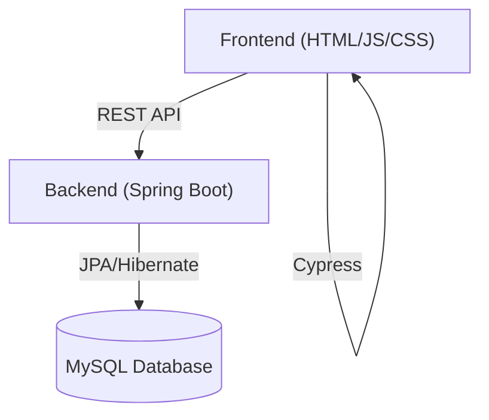
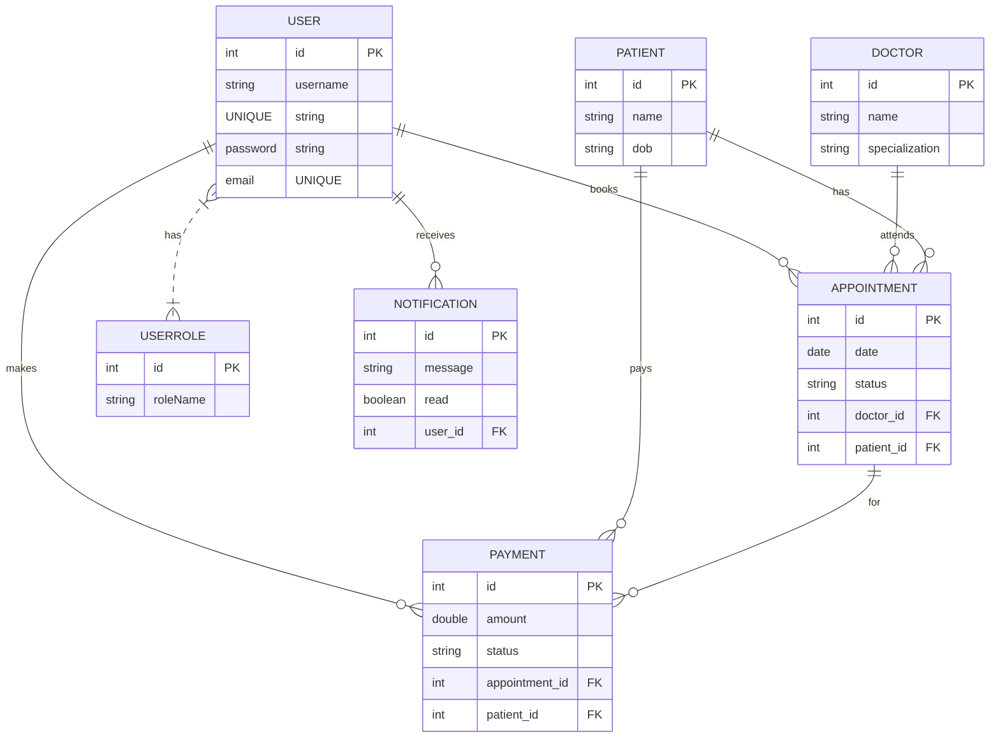
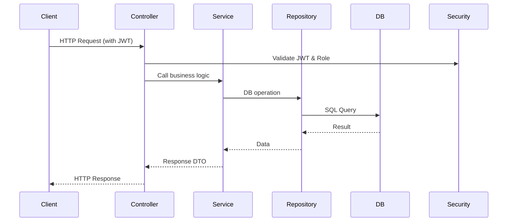

# Hospital Management System

## Overview
A full-stack Hospital Management System with a modern UI (HTML/CSS/JS) and a robust Spring Boot backend using MySQL. This project supports role-based access for Admin, Doctor, and Patient, and includes appointment, billing, notification, and user management features.

---

## ✨ Features
- **Role-based authentication** (Admin, Doctor, Patient)
- **Doctor Management:** Add, edit, view, and delete doctors
- **Patient Management:** Add, edit, view, and delete patients
- **Appointment Scheduling:** Book, update, cancel, and view appointments
- **Billing & Payments:** Manage and track payments
- **Notifications:** Send and view notifications for users
- **User Management:** Register, login, and manage user roles
- **JWT-secured REST API**
- **Responsive, multi-role UI**
- **End-to-end testing with Cypress**
- **Dockerized deployment**

---

## 🏗️ Architecture


---

## 🗄️ Database Schema (ER Diagram)


### Table Details
- **USER**: Stores all users. `username` and `email` are unique. Passwords are hashed.
- **USERROLE**: Maps users to roles (ADMIN, DOCTOR, PATIENT).
- **DOCTOR**: Doctor profiles.
- **PATIENT**: Patient profiles.
- **APPOINTMENT**: Appointments between doctors and patients. `status` (e.g., SCHEDULED, COMPLETED, CANCELLED).
- **PAYMENT**: Payments for appointments. `status` (e.g., PAID, PENDING).
- **NOTIFICATION**: System/user notifications.

---

## 🏛️ Backend Architecture

### Package Structure
- **controller/**: REST API endpoints (e.g., `AppointmentController.java`, `AuthController.java`)
- **service/**: Business logic (e.g., `AppointmentService.java`)
- **repository/**: JPA repositories for DB access
- **model/**: JPA entities (DB tables)
- **dto/**: Data Transfer Objects for API requests/responses
- **security/**: JWT, filters, user details, and security config

### Class Responsibilities
- **Controllers**: Handle HTTP requests, validate input, call services, return responses.
- **Services**: Contain business logic, interact with repositories.
- **Repositories**: Interface with the database using Spring Data JPA.
- **Models**: Represent DB tables/entities.
- **DTOs**: Used for API input/output, separate from entities.
- **Security**: JWT token generation/validation, user authentication, role checks.

### Backend Flow Diagram


---

## 🖥️ Frontend Architecture

### Folder Structure
- **HTML Pages**: Each role/page has its own HTML file.
- **js/auth.js**: Handles login, registration, JWT storage, and attaching tokens to requests.
- **js/main.js**: General UI logic, AJAX calls, DOM manipulation.
- **css/style.css**: All styling.

### Authentication Flow
1. User logs in via `login.html`.
2. `auth.js` sends credentials to `/auth/login`.
3. On success, JWT is stored in `localStorage`.
4. All API calls include JWT in `Authorization` header.
5. On logout or token expiry, user is redirected to login.

### Page Interactions
- Each page loads relevant data via AJAX from backend.
- Role-based navigation: Only authorized pages are accessible per user role.
- Error handling: Displays messages for failed API calls.

---

## 📑 Full API Documentation

### Authentication
#### Register
- **POST** `/auth/register`
- **Body:** `{ "username": "string", "password": "string", "email": "string", "role": "ADMIN|DOCTOR|PATIENT" }`
- **Response:** `201 Created` `{ "message": "User registered" }`
- **Errors:** `400 Bad Request` (missing/invalid fields), `409 Conflict` (username/email exists)

#### Login
- **POST** `/auth/login`
- **Body:** `{ "username": "string", "password": "string" }`
- **Response:** `200 OK` `{ "token": "<JWT>", "role": "ADMIN|DOCTOR|PATIENT" }`
- **Errors:** `401 Unauthorized` (invalid credentials)

### Appointments
#### List Appointments
- **GET** `/appointments`
- **Auth:** Yes (all roles)
- **Response:** `200 OK` `[ { "id": 1, "date": "2024-06-01", ... } ]`

#### Create Appointment
- **POST** `/appointments`
- **Auth:** Yes (Admin, Doctor, Patient)
- **Body:** `{ "doctorId": 1, "patientId": 2, "date": "2024-06-01", "status": "SCHEDULED" }`
- **Response:** `201 Created` `{ "id": 10, ... }`
- **Errors:** `400 Bad Request`, `403 Forbidden`

#### Update Appointment
- **PUT** `/appointments/{id}`
- **Auth:** Yes (Admin, Doctor)
- **Body:** `{ "status": "COMPLETED" }`
- **Response:** `200 OK` `{ ... }`
- **Errors:** `404 Not Found`, `403 Forbidden`

#### Delete Appointment
- **DELETE** `/appointments/{id}`
- **Auth:** Yes (Admin)
- **Response:** `204 No Content`
- **Errors:** `404 Not Found`, `403 Forbidden`

### Doctors
#### List Doctors
- **GET** `/doctors`
- **Auth:** Yes
- **Response:** `200 OK` `[ { "id": 1, "name": "Dr. Smith", ... } ]`

#### Add Doctor
- **POST** `/doctors`
- **Auth:** Admin
- **Body:** `{ "name": "Dr. Smith", "specialization": "Cardiology" }`
- **Response:** `201 Created` `{ "id": 5, ... }`
- **Errors:** `400 Bad Request`, `403 Forbidden`

### Patients
#### List Patients
- **GET** `/patients`
- **Auth:** Yes
- **Response:** `200 OK` `[ { "id": 1, "name": "John Doe", ... } ]`

#### Add Patient
- **POST** `/patients`
- **Auth:** Admin, Doctor
- **Body:** `{ "name": "John Doe", "dob": "1990-01-01" }`
- **Response:** `201 Created` `{ "id": 7, ... }`
- **Errors:** `400 Bad Request`, `403 Forbidden`

### Payments
#### List Payments
- **GET** `/payments`
- **Auth:** Yes
- **Response:** `200 OK` `[ { "id": 1, "amount": 100.0, ... } ]`

### Notifications
#### List Notifications
- **GET** `/notifications`
- **Auth:** Yes
- **Response:** `200 OK` `[ { "id": 1, "message": "...", ... } ]`

---

## 🧪 Testing (Cypress)

### Folder Structure
- `cypress/e2e/`: Test specs for each feature (CRUD, login, notifications, etc.)
- `cypress/fixtures/`: Test data
- `cypress/support/`: Custom commands, setup

### Running Tests
```sh
npm install
npx cypress open   # Interactive
npx cypress run    # Headless
```

### Writing a New Test
- Place new spec in `cypress/e2e/`.
- Use `cy.visit`, `cy.get`, `cy.request` for UI/API actions.

#### Advanced Example
```js
// cypress/e2e/appointment_crud_spec.js
it('creates and deletes an appointment', () => {
  cy.login('admin', 'adminpass'); // custom command
  cy.visit('/manage_appointments.html');
  cy.get('button#create-appointment').click();
  cy.get('input[name=doctor]').type('Dr. Smith');
  cy.get('input[name=patient]').type('John Doe');
  cy.get('input[name=date]').type('2024-06-01');
  cy.get('button[type=submit]').click();
  cy.contains('Appointment created').should('exist');
  cy.get('button.delete-appointment').last().click();
  cy.contains('Appointment deleted').should('exist');
});
```

---

## 🚀 Deployment
- Use Docker Compose for production deployment
- Set strong passwords and secrets in environment variables
- Use Nginx or similar to serve frontend
- Configure HTTPS for secure communication
- Scale backend and database as needed
- Regularly backup MySQL database
- Monitor logs and set up alerts for errors

---

## 🔒 Security
- **JWT**: Tokens are signed and validated using a secret key. Expiry is enforced.
- **Password Storage**: Passwords are hashed (e.g., BCrypt) before storing in DB.
- **Role-based Access**: Endpoints are protected by roles in `WebSecurityConfig.java`.
- **CORS**: Configured to allow frontend-backend communication.
- **Input Validation**: All API inputs are validated.
- **Sensitive Data**: Never log passwords or tokens.

---

## ❓ FAQ / Troubleshooting
- **Login fails:** Check backend logs, ensure DB is running, and credentials are correct
- **API 401 errors:** Ensure JWT token is sent in `Authorization` header
- **Frontend not loading:** Check static server or Docker container logs
- **Database errors:** Verify MySQL is running and credentials match
- **Cypress tests fail:** Ensure app is running and accessible at expected URLs
- **Port conflicts:** Change ports in `docker-compose.yml` or `application.properties`
- **JWT expired:** Login again to refresh token

---

## 📚 Glossary
- **JWT**: JSON Web Token, used for stateless authentication
- **CRUD**: Create, Read, Update, Delete
- **DTO**: Data Transfer Object
- **JPA**: Java Persistence API
- **CORS**: Cross-Origin Resource Sharing
- **SPA**: Single Page Application

---

## 📝 Changelog
- See [CHANGELOG.md] (create this file) for version history and updates.

---

## 🤝 Contributing
1. Fork the repo and create a feature branch
2. Follow code style and naming conventions
3. Add/modify tests for your changes
4. Submit a pull request with a clear description

---

## 📣 Need Help?
Open an issue or contact the maintainer.

---

## 📜 License
MIT License

Copyright (c) 2024 <Your Name>

Permission is hereby granted, free of charge, to any person obtaining a copy
of this software and associated documentation files (the "Software"), to deal
in the Software without restriction, including without limitation the rights
to use, copy, modify, merge, publish, distribute, sublicense, and/or sell
copies of the Software, and to permit persons to whom the Software is
furnished to do so, subject to the following conditions:

The above copyright notice and this permission notice shall be included in all
copies or substantial portions of the Software.

THE SOFTWARE IS PROVIDED "AS IS", WITHOUT WARRANTY OF ANY KIND, EXPRESS OR
IMPLIED, INCLUDING BUT NOT LIMITED TO THE WARRANTIES OF MERCHANTABILITY,
FITNESS FOR A PARTICULAR PURPOSE AND NONINFRINGEMENT. IN NO EVENT SHALL THE
AUTHORS OR COPYRIGHT HOLDERS BE LIABLE FOR ANY CLAIM, DAMAGES OR OTHER
LIABILITY, WHETHER IN AN ACTION OF CONTRACT, TORT OR OTHERWISE, ARISING FROM,
OUT OF OR IN CONNECTION WITH THE SOFTWARE OR THE USE OR OTHER DEALINGS IN THE
SOFTWARE. 


